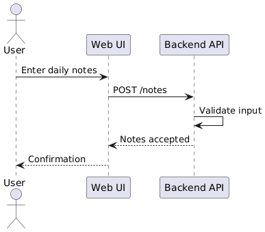
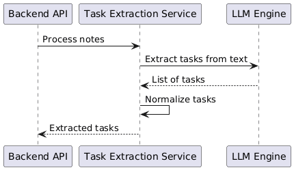
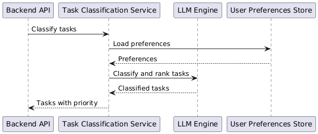
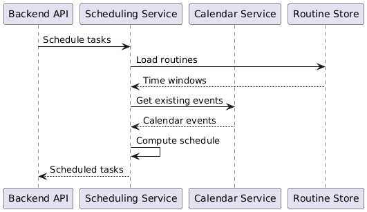
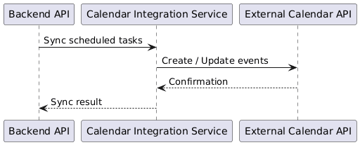
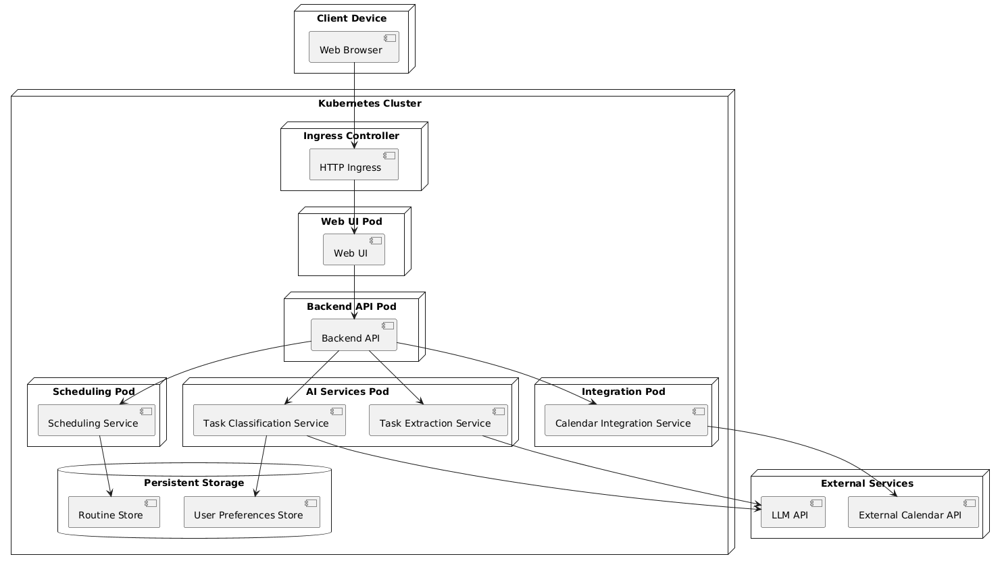

# 1.Project Definition

Planner_AI is a calendar task scheduling system that supports users in organizing daily activities based on unstructured textual input. The project focuses on the transformation of freeform daily notes and action logs into a structured calendar representation that can be directly used for planning and time management.

The system applies natural language processing techniques to identify tasks within text, followed by automated classification, prioritization, and scheduling according to user-defined routines and constraints. Planner_AI is implemented as a cloud-native application and is intended to be deployed and evaluated in a Kubernetes-based environment.

# 2.Overall Description

Planner_AI provides an end-to-end workflow for converting informal user input into scheduled calendar events. Users submit daily notes or action logs written in natural language, which may contain task descriptions, reminders, deadlines, or loosely defined activities.

The input is processed by a task extraction component that detects actionable items. These tasks are subsequently categorized (for example, work or personal) and ordered based on priority and contextual information. A scheduling module then assigns tasks to available calendar time slots while respecting predefined routines, availability constraints, and existing calendar events. The resulting schedule is synchronized with the user’s calendar system and presented as a structured daily or weekly plan.

# 3. Architecturally significant use cases

## Use-case 1. – Submit Daily Note
The user enters daily notes through the web interface and submits them to the system. The web interface forwards the input to the backend API, where basic validation is performed. After successful validation, the notes are accepted for further processing and the user receives a confirmation.



#### plantuml code for revision

@startuml
actor User
participant "Web UI" as UI
participant "Backend API" as API

User -> UI : Enter daily notes
UI -> API : POST /notes
API -> API : Validate input
API --> UI : Notes accepted
UI --> User : Confirmation
@enduml


## Use-case 2. – Extract Tasks from Notes

The backend API forwards the submitted notes to the task extraction service. This service uses a language model to identify actionable tasks within the text. The extracted tasks are then normalized into a structured format before being returned to the backend for further processing.



#### plantuml code for revision

@startuml
participant "Backend API" as API
participant "Task Extraction Service" as Extractor
participant "LLM Engine" as LLM

API -> Extractor : Process notes
Extractor -> LLM : Extract tasks from text
LLM --> Extractor : List of tasks
Extractor -> Extractor : Normalize tasks
Extractor --> API : Extracted tasks
@enduml


## Use-case 3. – Classify and Prioritize Task

The backend requests task classification and prioritization from the classification service. User preferences are loaded to provide additional context. A language model is used to assist with task categorization and priority assignment, after which the enriched task data is returned to the backend.



#### plantuml code for revision

@startuml
participant "Backend API" as API
participant "Task Classification Service" as Classifier
participant "LLM Engine" as LLM
participant "User Preferences Store" as Prefs

API -> Classifier : Classify tasks
Classifier -> Prefs : Load preferences
Prefs --> Classifier : Preferences
Classifier -> LLM : Classify and rank tasks
LLM --> Classifier : Classified tasks
Classifier --> API : Tasks with priority
@enduml


## Use-case 4. – Schedule Tasks into Calendar

The backend invokes the scheduling service to assign tasks to calendar time slots. The scheduler loads predefined user routines and retrieves existing calendar events. Based on this information, it computes a feasible schedule that respects availability constraints and avoids conflicts, and returns the scheduled tasks.



#### plantuml code for revision

@startuml
participant "Backend API" as API
participant "Scheduling Service" as Scheduler
participant "Calendar Service" as Calendar
participant "Routine Store" as Routines

API -> Scheduler : Schedule tasks
Scheduler -> Routines : Load routines
Routines --> Scheduler : Time windows
Scheduler -> Calendar : Get existing events
Calendar --> Scheduler : Calendar events
Scheduler -> Scheduler : Compute schedule
Scheduler --> API : Scheduled tasks
@enduml


## Use-case 5. – Synchronize with External Calendar

The backend initiates synchronization of scheduled tasks through the calendar integration service. The integration service communicates with an external calendar API to create or update calendar events. After synchronization is completed, the result is reported back to the backend.



#### plantuml code for revision

@startuml
participant "Backend API" as API
participant "Calendar Integration Service" as Integration
participant "External Calendar API" as ExternalCalendar

API -> Integration : Sync scheduled tasks
Integration -> ExternalCalendar : Create / Update events
ExternalCalendar --> Integration : Confirmation
Integration --> API : Sync result
@enduml


# 4. Component Diagram

## Components

- Web UIWeb UI
User-facing interface for submitting notes and viewing scheduled tasks.

- Backend API
Central orchestration component that coordinates processing, scheduling, and integration.

- Task Extraction Service
Extracts actionable tasks from unstructured text input.

- Task Classification Service
Categorizes tasks and assigns priorities using user preferences and AI support.

- Scheduling Service
Assigns tasks to calendar time slots based on routines and availability.

- LLM Engine
Provides language understanding capabilities for extraction and classification.

- User Preferences Store
Stores user-specific settings and preferences.

- Routine Store
Stores predefined routines and availability windows.

- Calendar Integration Service
Handles communication with external calendar systems.

- External Calendar API
Third-party calendar service (e.g., Google Calendar).


## Component Interaction Overview:

The Web UI serves as the entry point for user input and communicates exclusively with the Backend API. The Backend API acts as the central coordination component and delegates specific responsibilities to specialized services. Task extraction and classification services use a shared LLM engine for natural language processing, while scheduling logic is handled deterministically by the scheduling service. External calendar systems are accessed exclusively through a dedicated integration component, ensuring clear separation of concerns.


#### plantuml code for revision

@startuml
package "Planner_AI System" {

  [Web UI] --> [Backend API]

  [Backend API] --> [Task Extraction Service]
  [Backend API] --> [Task Classification Service]
  [Backend API] --> [Scheduling Service]
  [Backend API] --> [Calendar Integration Service]

  [Task Extraction Service] --> [LLM Engine]
  [Task Classification Service] --> [LLM Engine]

  [Task Classification Service] --> [User Preferences Store]
  [Scheduling Service] --> [Routine Store]

  [Scheduling Service] --> [Calendar Integration Service]
}

[Calendar Integration Service] --> [External Calendar API]

@enduml

# 5. Deployment diagram

## Deployment View

The Planner_AI system is deployed as a set of containerized services running inside a Kubernetes cluster. Users interact with the system through a web browser, which accesses the application via an ingress controller. The Web UI and Backend API are deployed as separate pods, enabling independent scaling and deployment.

AI-related functionality is deployed as dedicated services that communicate with an external LLM API. Scheduling and integration logic are isolated in their own pods to maintain separation of concerns. User preferences and routines are stored in persistent storage within the cluster. External calendar systems are accessed through a dedicated integration service.



#### plantuml code for revision

@startuml
node "Client Device" {
  component "Web Browser"
}

node "Kubernetes Cluster" {

  node "Ingress Controller" {
    component "HTTP Ingress"
  }

  node "Web UI Pod" {
    component "Web UI"
  }

  node "Backend API Pod" {
    component "Backend API"
  }

  node "AI Services Pod" {
    component "Task Extraction Service"
    component "Task Classification Service"
  }

  node "Scheduling Pod" {
    component "Scheduling Service"
  }

  node "Integration Pod" {
    component "Calendar Integration Service"
  }

  database "Persistent Storage" {
    component "User Preferences Store"
    component "Routine Store"
  }
}

node "External Services" {
  component "External Calendar API"
  component "LLM API"
}

"Web Browser" --> "HTTP Ingress"
"HTTP Ingress" --> "Web UI"
"Web UI" --> "Backend API"

"Backend API" --> "Task Extraction Service"
"Backend API" --> "Task Classification Service"
"Backend API" --> "Scheduling Service"
"Backend API" --> "Calendar Integration Service"

"Task Extraction Service" --> "LLM API"
"Task Classification Service" --> "LLM API"

"Task Classification Service" --> "User Preferences Store"
"Scheduling Service" --> "Routine Store"

"Calendar Integration Service" --> "External Calendar API"
@enduml

# 6. Deployment Instructions

## Prerequisites

Before deploying the Planner_AI system, ensure you have the following tools installed:

### Required Tools
- **Local Kubernetes Cluster**: One of the following:
  - [Minikube](https://minikube.sigs.k8s.io/docs/start/) (recommended for development)
  - [Kind](https://kind.sigs.k8s.io/docs/user/quick-start/) (Kubernetes in Docker)
  - [k3d](https://k3d.io/) (k3s in Docker)
- **kubectl**: [Kubernetes command-line tool](https://kubernetes.io/docs/tasks/tools/)
- **Docker**: [Container platform](https://docs.docker.com/get-docker/)

### Verify Installation
```bash
# Check kubectl is configured
kubectl cluster-info

# Check Docker is running
docker --version
```

## Deployment Steps

### 1. Start Local Kubernetes Cluster

**For Minikube:**
```bash
minikube start
```

**For Kind:**
```bash
kind create cluster --name planner-ai
```

**For k3d:**
```bash
k3d cluster create planner-ai
```

### 2. Build the Backend Image

Navigate to the project root and build the Docker image in your cluster's context:

**For Minikube:**
```bash
# Configure shell to use minikube's Docker daemon
eval $(minikube docker-env)

# Build the image
docker build -t planner-ai-backend:latest .
```

**For Kind:**
```bash
# Build the image
docker build -t planner-ai-backend:latest .

# Load into Kind cluster
kind load docker-image planner-ai-backend:latest --name planner-ai
```

**For k3d:**
```bash
# Build the image
docker build -t planner-ai-backend:latest .

# Load into k3d cluster
k3d image import planner-ai-backend:latest --cluster planner-ai
```

### 3. Deploy to Kubernetes

Apply the Kubernetes manifests:

```bash
kubectl apply -f k8s/
```

Verify the deployment:

```bash
# Check all resources
kubectl get deploy,svc,ingress,pods

# Wait for pod to be ready
kubectl wait --for=condition=ready pod -l app=planner-ai-backend --timeout=300s
```

### 4. Access the Application

#### Option A: Port Forward (Simplest)

```bash
# Forward service to local port
kubectl port-forward svc/planner-ai-backend 8000:80
```

Then access:
- **API Docs**: http://localhost:8000/docs
- **API Root**: http://localhost:8000

#### Option B: Ingress (Production-like)

1. **Enable Ingress Controller** (Minikube only):
   ```bash
   minikube addons enable ingress
   ```

2. **Configure Local DNS**:
   Add this line to `/etc/hosts` (requires sudo):
   ```
   127.0.0.1 planner-ai.local
   ```

3. **Start Tunnel** (Minikube only):
   ```bash
   minikube tunnel
   ```

4. **Access Application**:
   - **API Docs**: http://planner-ai.local/docs
   - **API Root**: http://planner-ai.local

## Troubleshooting

### Pod Not Starting
```bash
# Check pod status
kubectl get pods

# Check pod logs
kubectl logs -l app=planner-ai-backend

# Describe pod for detailed info
kubectl describe pod -l app=planner-ai-backend
```

### Image Pull Issues
```bash
# Verify image exists in cluster
# For Minikube:
minikube ssh -- docker images | grep planner-ai-backend

# For Kind/k3d: Rebuild and reload image
docker build -t planner-ai-backend:latest .
kind load docker-image planner-ai-backend:latest --name planner-ai  # or k3d equivalent
```

### Clean Up
```bash
# Remove application
kubectl delete -f k8s/

# Stop cluster
minikube stop          # For Minikube
kind delete cluster --name planner-ai    # For Kind
k3d cluster delete planner-ai            # For k3d
```

# 7. Demo Video

[Download Demo Video](https://github.com/user-attachments/assets/2fe21836-48b3-4905-ba90-8178aa3389ba)
```
